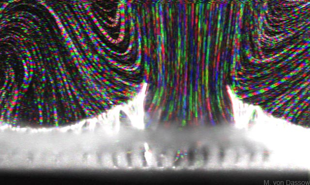

# BryozoanModel2
## Feedback between form and function in fluid transport systems.

**COMMENTS WELCOME: Please provide suggestions by opening an issue.**

### What is this project for?
This research project investigates how biological fluid transport systems pattern themselves and maintain their ability to function despite injuries and other perturbations. Specific goals are to: 1) decipher how fluid flow influences patterning of a vessel-less, distributed fluid transport system; and 2) determine the sensitivity of flow-regulated patterning to variation in system parameters or injury. We will integrate experiments with mathematical/computational and physical models to achieve these goals.

### Why is this important or useful?

Biological fluid transport systems are among the most complex biological systems, with hundreds to billions of interacting parts. Deciphering how organisms generate functional, resilient transport systems will help in identifying principles that can be used to design engineered systems or optimization algorithms. It will also help in understanding how these complex biological systems have evolved, and what limits their resilience (e.g. how does feedback between form and function affect aging of a system?).

### Contributions welcome!

Contributions – including questions – from all interested people are encouraged. For an introduction to the project's background and current state see the [BryoTheory](BryoTheory.ipynb) page; for information on how to contribute see our ['how to contribute' page](CONTRIBUTING.md). 

### Questions?

Either raise an 'issue' or contact the me at: mickey {dot} vondassow {at sign} ronininstitute {dot} org 

### Expected products: 

This project is intended to lead to publications in scientific journals, in addition to producing new methods, models, and code. Major contributions could warrant authorship on some of these papers. Please see the 'authorship' section of the ['how to contribute'](CONTRIBUTING.md) page. 

### Planned project components:

* Develop a computational/mathematical model of chimney formation to examine what determines its resilience to perturbations.
* Design hydrodynamically-scaled physical models of the organism to help match the computational model to the real organism. 
* Design, implement, and analyze experiments to test hypotheses about how flow regulates development in colonial bryozoans.
